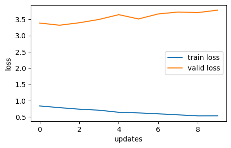
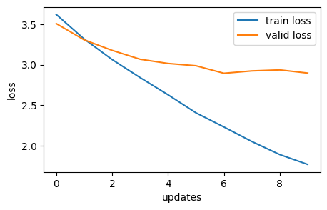
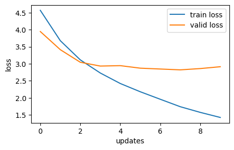
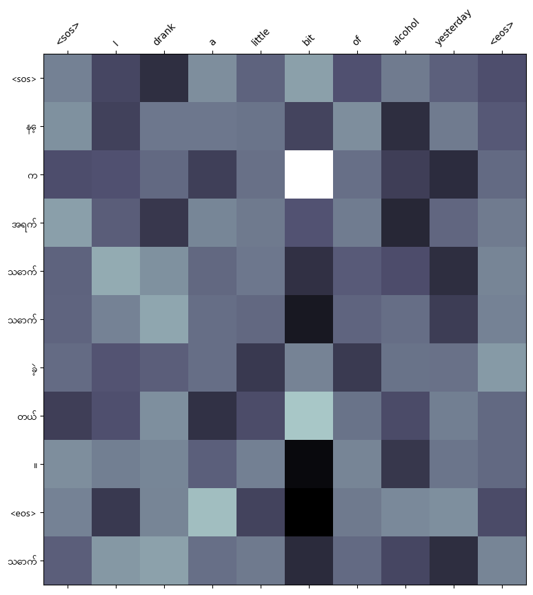
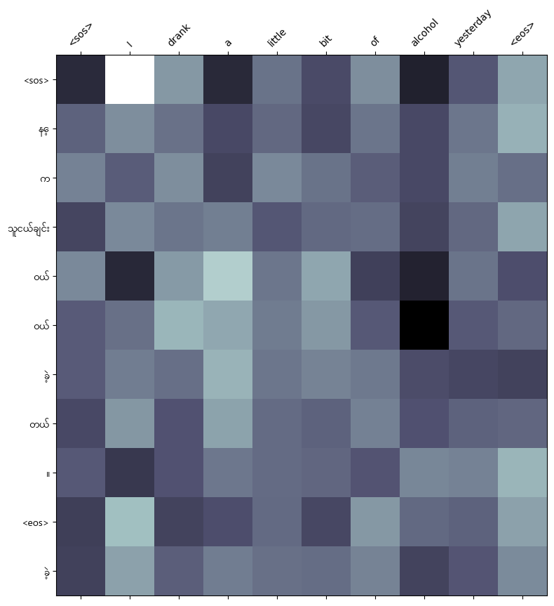
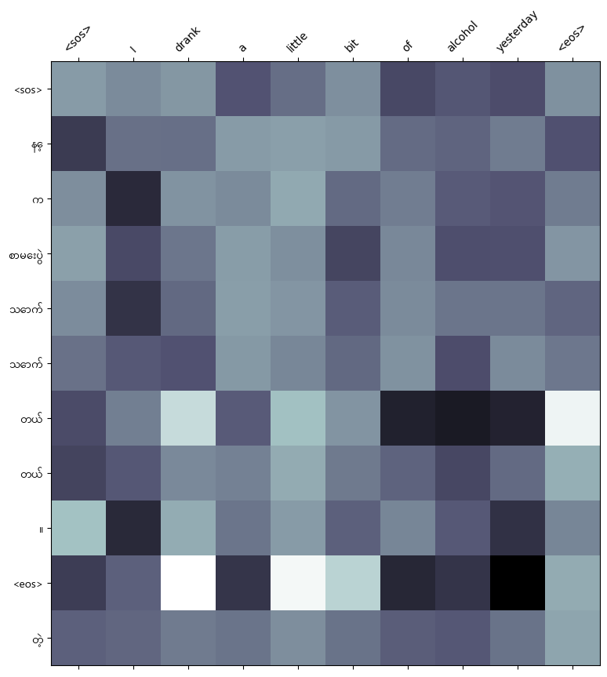

# NLP A3
 AIT NLP Assignment 3

- [Student Information](#student-information)
- [Installation and Setup](#installation-and-setup)
- [Usage](#usage)
- [Training Data](#training-data)
- [Preprocessing Data](#preprocessing-data)
- [Attention Mechanism Comparison](#attention-mechanism-comparison)
- [Loss Graph](#loss-graph)
- [Attention Map](#attention-map)
- [Relation between Burmese and Additive Attention](#relation-between-burmese-and-additive-attention)
- [Web application and model interface](#web-application-and-model-interface)

## Student Information
Name - Minn Banya  
ID - st124145

## Installation and Setup
Run docker compose up  
Webapp at localhost:8000

## Usage
Enter one or more input words and the website displays the translated text in Burmese (Myanmar).

## Training Data
Corpus source - TUFS Asian Language Parallel Corpus (TALPCo) (https://github.com/matbahasa/TALPCo?fbclid=IwAR0QuArqnoLub0WDPK2FL4e6OLaWBOEShVL-LoQxeAJ_qpBnLXnZ80YVJSU)  

The `data-eng.txt` and `data-myn.txt` in the TALPCo repository is preprocessed into csv files in `PrepTrainData.py` and uploaded to huggingface at `minnbanya/en-my-nlp-a3`.

Training    -   1093 rows  
Validation  -   137 rows  
Testing     -   137 rows

## Preprocessing Data
English(source language) - tokenized using torch get_tokenizer.

Burmese/Myanmar (target language) - tokenized using Dr.Ye Kyaw Thu's myWord segmenter (https://github.com/ye-kyaw-thu/myWord)
- Burmese language consists of syllables combined into words with the spaces not containing any meaning. As such this regular expression with these constants are used to firstly breakdown the target sentence into individual syllables :  

    myConsonant = r"က-အ"  
    enChar = r"a-zA-Z0-9"  
    otherChar = r"ဣဤဥဦဧဩဪဿ၌၍၏၀-၉၊။!-/:-@[-`{-~\s"  
    ssSymbol = r'္'  
    aThat = r'်'  
    BreakPattern = re.compile(r"((?<!" + ssSymbol + r")["+ myConsonant + r"](?![" + aThat + ssSymbol + r"])" + r"|[" + enChar + otherChar + r"])", re.UNICODE)  

    which turns a target input of this :  
    'ဒီခေတ်ကြီးမှာ ကုဒ်တွေအရမ်းများလွန်းနေတယ် ဒါဟာ ၀မ်းနည်းစရာကောင်းပေမဲ့ မှန်ကန်တဲ့အကြောင်းအချက်ပါ။'

    into this : ['ဒီ','ခေတ်','ကြီး','မှာ','ကုဒ်','တွေ','အ','ရမ်း','များ','လွန်း','နေ','တယ်','ဒါ','ဟာ','၀မ်း','နည်း','စ','ရာ','ကောင်း','ပေ','မဲ့','မှန်','ကန်','တဲ့','အ','ကြောင်း','အ','ချက်','ပါ','။']

    However, each individual syllable may or may not be part of a combined word with a specific meaning. As such, the individual syllables are then combined to specific word combinations in the target language to produce a meaningful tokenized sentence : ['ဒီ', 'ခေတ်', 'ကြီး', 'မှာ', 'ကုဒ်', 'တွေ', 'အရမ်း', 'များ', 'လွန်း', 'နေ', 'တယ်', 'ဒါ', 'ဟာ', '၀မ်း', 'နည်း', 'စရာ', 'ကောင်း', 'ပေမဲ့', 'မှန်ကန်', 'တဲ့', 'အကြောင်းအချက်', 'ပါ', '။']

Both tokenizers are now ready and the tokenized corpus is used to build a vocabulary with tokens which occur with a minimum frequency of two times.

The corpus, vocab transform, tensor tranform and collate function (padding) are then used to build dataloaders for the modelling process.

## Training Process
Epochs - 10 (small training data)  (reduced from 30 due to overfitting)
Hidden dimension - 256  
Feedforward dimension - 512  
Number of encoder/decoder layers - 3  
Number of heads for multihead attention - 8  
Dropout rate - 0.1  

## Attention Mechanism Comparison

| Attentions       | Training Loss | Training PPL | Validation Loss | Validation PPL |
|------------------|---------------|--------------|-----------------|----------------|
| General       |        0.787          |       2.196        |      3.316         |        27.559         |
| Multiplicative|         2.895          |       18.079        |       2.230        |         9.299        |
| Additive      |        2.821           |      16.797        |       1.739         |          5.693       |

The performance of the additive attention mechanism is slightly better than the performance of the other two mechanisms. The reasoning and implication behind this will be explained in [Relation between Burmese and Additive Attention](#relation-between-burmese-and-additive-attention).

The computational efficiency :  
General Attention : 2m 57s  
Multiplicative Attention : 2m 59s  
Additive Attention : 3m 2s  
We can conclude that all three models are equal in terms of computational efficiency.

The translation accuracy, however, is lacking for all three mechanisms. Since there is no clear benchmark available for Myanmar language, the additive attention mechanism was chosen based purely on validation loss and perplexity.

## Loss Graph
| General Attention Loss                                     | Multiplicative Attention Loss                                      | Additive Attention Loss                                       |
|----------------------------------------------|----------------------------------------------|----------------------------------------------|
|  |  |  |
 

## Attention Map
| General Attention Map                                     | Multiplicative Attention Map                                      | Additive Attention Map                                       |
|----------------------------------------------|----------------------------------------------|----------------------------------------------|
|  |  |  | 

## Relation between Burmese and Additive Attention
The complexity of relationships between the tokens in the Burmese language as well as the cross relations between each Burmese phrase and English word is assumed to be the primary reason behind the slight performance advantage of the additive attention model over the other two models. The extra trainable hyperparameters of the additive attention mechanism allows for these complex relationships to be learned by the model.

## Web application and model interface
The web application loads the model and pass the user input as source. The greedy decode takes that user input, sets the targets as `<sos>` token and starts predicting the next word. The next word is then appended to the target list and the process repeats until the max length is reached or an `<eos>` token is predicted. The targets are then joined and displayed back to the user as translated text.

