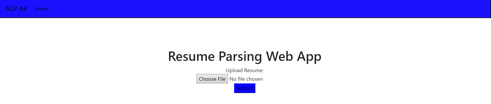
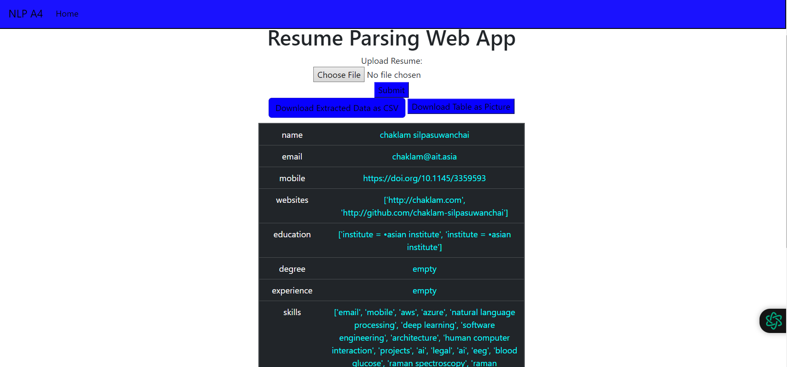
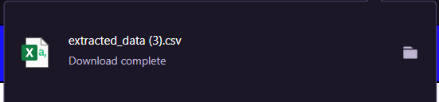
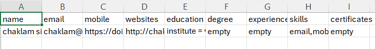
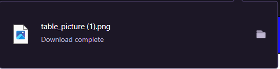
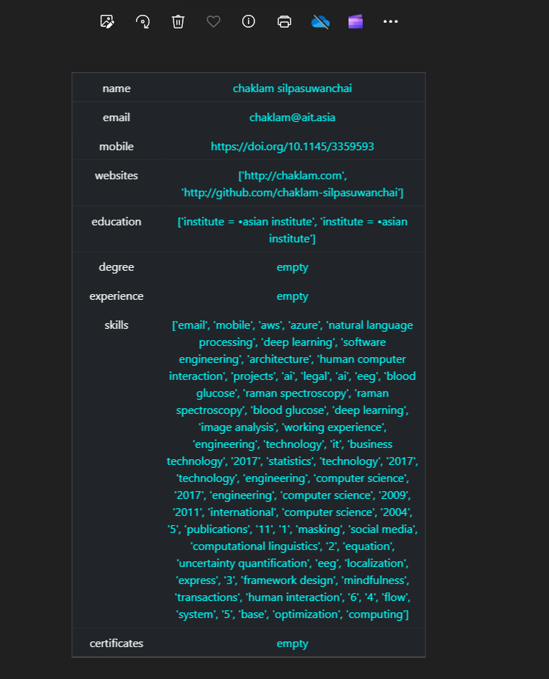

# NLP A4
 AIT NLP Assignment 4

- [Student Information](#student-information)
- [Installation and Setup](#installation-and-setup)
- [Usage](#usage)
- [Extra features](#extra-features)

## Student Information
Name - Minn Banya  
ID - st124145

## Installation and Setup
Webapp at localhost:8000

## Usage
cd into app folder and run 'python3 app.py'  
Choose a pdf resume file for upload.  

  

  

The webpage will show the extracted info with download button for csv or for table picture.  

  
  

  
  

## Extra features
The Resume Parser notebook is extended by add extra patterns and text cleaning.
Skills, degrees and certification json files were added to the ruler.
Name, Email, Mobile number, Websites, and Work locations were also added to the ruler.
Educational institutes were matched using re.search().

The results are displayed as a table and a download csv option is provided by converting the extracted info dictionary into a csv file or a download table option as a png file of the displayed table.
