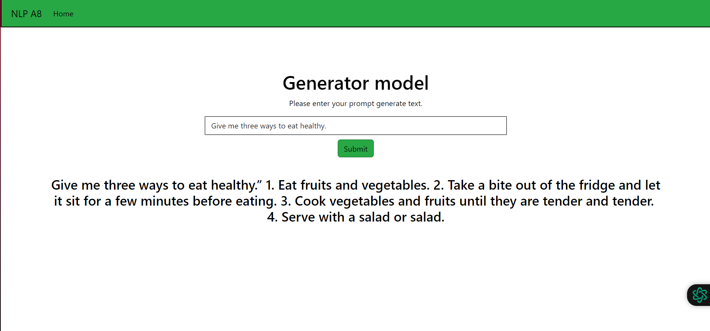

# NLP A8
 AIT NLP Assignment 8

- [Student Information](#student-information)
- [Installation and Setup](#installation-and-setup)
- [Usage](#usage)
- [Training](#training)
- [Evaluation](#evaluation)
- [Web application and model interface](#web-application-and-model-interface)

## Student Information
Name - Minn Banya  
ID - st124145

## Installation and Setup
To run the web application, follow these steps:
1. Run the `Alpaca-SFT` notebook to train and save the model.
2. Navigate to the `app` folder in the terminal.
3. Run the command `python3 app.py`

## Usage
Access the webapp at `localhost:8000` after running the setup steps.

## Training
The alpaca dataset from `https://github.com/tatsu-lab/stanford_alpaca/blob/main/alpaca_data.json` is downloaded and the json file is mapped to a dataset using `Dataset.from_json()`. The `instruction` and `output` of the dataset is formatted into a suitable instruction format for model training. The model used is `distilgpt2` and the training is done using the `SFTTrainer`. The function called is `trainer.train()`.

## Evaluation
The evaluation is done using the `https://huggingface.co/datasets/tatsu-lab/alpaca_eval` dataset. The eval_dataset is passed to the `SFTTrainer` during initialization. The evaluation is done by calling the `trainer.evaluate()` function. The model is then saved using `torch` and the tokenizer is saved using `pickle`.

## Web application and model interface
The web application loads the model and pass the user input as source. The input text is encoded using the tokenizer and passed to the model using these parameters:
- max_length=256
- num_beams=5
- no_repeat_ngram_size=2
- top_k=50
- top_p=0.95
- temperature=0.7

The generation by the model is decoded and displayed back to the user.

